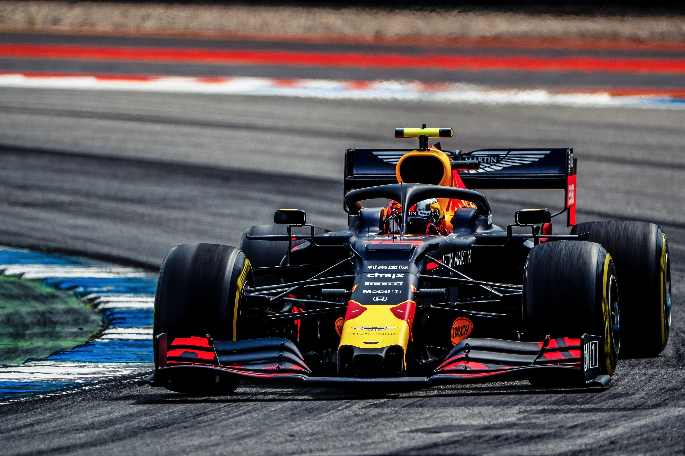
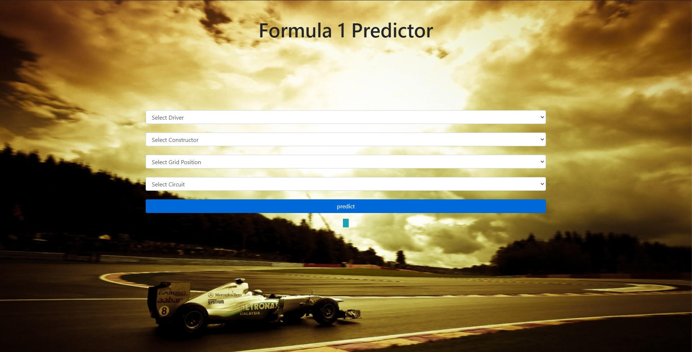
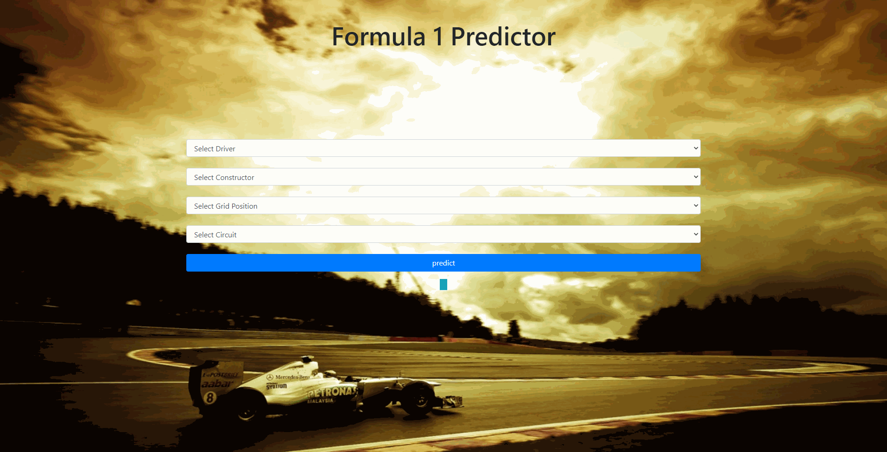

# Formula 1 Race Prediction


# Table of contents
1. [Introduction](#introduction)
2. [What is Formula ](#Dash)
3. [Project Overview](#Overview)
4. [Requirements](#req)
5. [Demo](#Demo)
6. [Deployment](#deployment)
7. [Tools Used](#tools)
8. [Credits](#credits)


## Introduction <a name="introduction"></a>
 This project is a Machine Learning project using [Sikit-learn]('https://scikit-learn.org/stable/index.html' "Sikit-Learn Documentation") module in [Python]('https://www.python.org/downloads/release/python-361/ "Download Python 3.6.1") to predict the Formula 1 race result.


## What is Formula 1 ? <a name="Dash"></a>
[Formula one]('https://www.formula1.com/') (also known as Formula 1 or F1) is the highest class of international single-seater auto racing sanctioned by the Fédération Internationale de l'Automobile (FIA) and owned by the Formula One Group. The World Drivers' Championship, which became the FIA Formula One World Championship in 1981, has been one of the premier forms of racing around the world since its inaugural season in 1950. The word "formula" in the name refers to the set of rules to which all participants' cars must conform.[1] A Formula One season consists of a series of races, known as Grands Prix (French for ''grand prizes' or 'great prizes''), which take place worldwide on purpose-built circuits and on public roads.
Formula One cars are the fastest regulated road-course racing cars in the world, owing to very high cornering speeds achieved through the generation of large amounts of aerodynamic downforce. The cars underwent major changes in 2017,[3] allowing wider front and rear wings, and wider tyres, resulting in peak cornering forces near 6.5 lateral g and top speeds of up to approximately 370 km/h (230 mph).[4][5] As of 2019 the hybrid engines are limited in performance to a maximum of 15,000 rpm, the cars are very dependent on electronics and aerodynamics, suspension and tyres. Traction control and other driving aids have been banned since 2008.[6]

While Europe is the sport's traditional base, the championship operates globally, with 11 of the 21 races in the 2019 season taking place outside Europe. With the annual cost of running a mid-tier team—designing, building, and maintaining cars, pay, transport—being US$120 million,[7] its financial and political battles are widely reported. Its high profile and popularity have created a major merchandising environment, which has resulted in large investments from sponsors and budgets (in the hundreds of millions for the constructors). On 23 January 2017 Liberty Media confirmed the completion of the acquisition of Delta Topco, the company that controls Formula One, from private-equity firm CVC Capital Partners for $8 billion.

In case you dont know this is what a modren Formula one car looks like.


## Project Overview<a name  = "Overview"></a>

This project aims towards understanding the data of past Formula 1 races and predict the outcome of the race for user inputs by using Machine Learning Algorithms.
checkout the [ipython notebook](https://github.com/SampathHN/Formula-1-Prediction/blob/master/F1.ipynb "F1.ipynb") for data exploration and model building
 


## requirements<a name  = "req"></a>
Project runs on [Python 3.6.1](https://www.python.org/downloads/release/python-361/ "Download Python 3.6.1")  
and all requiremets can be installed by following command you can find requirement.txt [here](https://github.com/SampathHN/Formula-1-Prediction/blob/master/requirements.txt "requirements.txt")
```python
pip install -r requirements.txt
```

## Demo<a name  = "Demo"></a>
#### Predictor



#### Example




## Deployment<a name  = "deployment"></a>

Application is developed with [Flask framework for python](https://flask.palletsprojects.com/en/1.1.x/ "Flask Documentation") and deployed on [Heroku](https://devcenter.heroku.com/start "Heroku").


### Try the application [here](https://f1predictor.herokuapp.com "f1predictor")


## Tools used <a name="tools"></a>


<table>
  <tr>
    <td></td>
     <td></td>
     <td></td>
  </tr>
  <tr>
    <td></td>
    <td></td>
    
  </tr>
 </table>

 
<table>
  <tr>
    <td></td>
     <td></td>
     <td></td>
  </tr>
  <tr>
    <td></td>
    
  </tr>
 </table>


 ## Credits  
 All Data was collected from [Ergast Developer API](https://ergast.com/mrd/ "ergast.com")  

